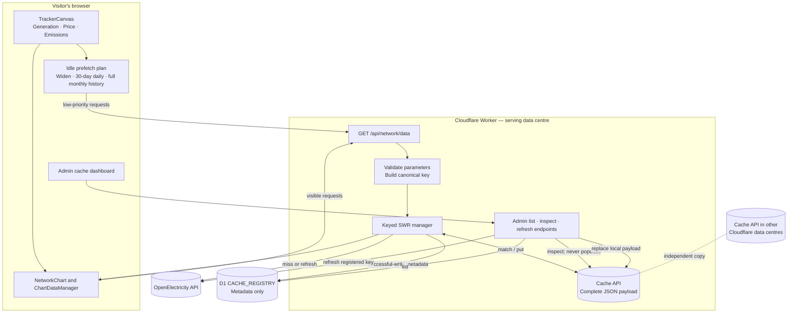

# Admin network-cache endpoints

Authenticated inspection and refresh of the `/api/network/data` keyed SWR edge
cache (`src/lib/server/keyed-swr-cache.js`). The cache makes historical tracker
charts fast but its contents invisible; these endpoints and the Studio
dashboard at `/studio/cache/network-data` (the documented browser caller,
`src/routes/(main)/studio/cache/network-data/`) let maintainers see which
historical data visitors may receive, inspect complete cached responses,
identify stale entries and refresh corrected upstream data — without purging
the whole Cloudflare zone.

## End-to-end architecture

The browser, Worker cache and registry have different responsibilities. The
browser predicts which ranges the visitor may request next; the Worker serves
and stores the final chart response; D1 makes those otherwise invisible writes
searchable by administrators.



The OpenElectricity API may have its own cache. That protects its database and
upstream processing; this Worker cache still avoids the API round trip, keeps
the final browser-ready response near visitors and can serve stale data during
an API slowdown. If API cache performance makes full-history responses cheap,
measure the direct API and `/api/network/data` cold/warm timings before reducing
the prewarming plan; the two layers are complementary rather than automatically
interchangeable.

## Public request lifecycle

`/api/network/data` validates every query and converts it to one canonical key
shared by the public endpoint, Cache API, D1 registry and admin endpoints. This
prevents reordered or equivalent parameters from creating different cache
identities.

| Local Cache API state | Visitor response                                | Background work                                         |
| --------------------- | ----------------------------------------------- | ------------------------------------------------------- |
| Fresh                 | Return immediately with `x-oe-cache: hit`       | None                                                    |
| Stale but retained    | Return immediately with `x-oe-cache: stale`     | Fetch upstream, replace the local payload and update D1 |
| Missing or evicted    | Wait for upstream and return `x-oe-cache: miss` | Store the successful payload and update D1              |

Concurrent identical requests handled by the same Worker isolate share one
upstream fetch. Fetch or processing failures never replace a valid cached
payload. Live windows are fresh for five minutes, fully historical windows for
six hours, and Cache API responses advertise up to seven days of retention.
Cloudflare may evict them earlier.

## Tracker prewarming

Prewarming is initiated by the browser, not by a cron job, D1 or the dashboard.
`TrackerCanvas.svelte` passes an active-metric plan to each of its three
`NetworkChart` instances. A chart becomes eligible only after its initially
visible range has loaded, no visible fetch is pending, a viewport exists and
the user is not panning or zooming.

The chart host then queues one job per browser idle slice. It uses
`requestIdleCallback` with a two-second timeout, falling back to a 200 ms timer
where that API is unavailable. This is why production warms commonly appear
about three seconds after page load: the delay is initial loading plus idle
scheduling, not a hard-coded three-second timer. Each resulting browser fetch
uses `priority: 'low'` and otherwise calls the normal `/api/network/data`
endpoint.

Jobs run in this order for every chart:

1. **Widen the current grain.** Request up to three current viewport spans on
   either side, bounded by that interval's API range limit and by the current
   time. For an initial three-day view ending now, the future side is clipped,
   so this normally covers the visible three days plus about nine earlier days.
2. **Warm daily data.** Request the last 30 days at `1d` for the planned metric.
3. **Warm full history.** Request the last 11,000 days at `1M`, reaching roughly
   back to December 1998.

The plans are:

| Chart      | Daily/monthly metric                                              |
| ---------- | ----------------------------------------------------------------- |
| Generation | `energy`                                                          |
| Price      | `price` or `market_value`, following the active toggle            |
| Emissions  | `emissions_intensity` or `emissions`, following the active toggle |

Completed job keys, the browser's shared in-flight broker and response LRU,
warm-manager stashes, same-isolate Worker de-duplication and Cache API hits all
avoid repeated work. A matching daily or monthly manager stays in a six-entry
per-chart stash, so a later 30D, 1Y or All selection can revive processed data
without another browser request when it still covers the viewport. After a
reload, the in-memory manager is gone but the serving data centre may still
return the warmed edge response.

Changing Price/Market value or Emissions Intensity/Volume re-plans for the new
metric. Changing region clears the old region's warm managers and begins again
after the new visible load settles. Gestures pause queued scheduling; unmounting
the chart cancels it. Prefetching warms only the Cloudflare data centre serving
that visitor. Other data centres build or refresh their own copies.

## How the registry works

A Cloudflare D1 database (bound as `CACHE_REGISTRY`) stores metadata about
every successful Cache API write; the full responses stay in `caches.default`.
The keyed SWR cache exposes best-effort lifecycle hooks (`onStored`,
`onRefreshError`) that `src/lib/server/network-data.js` wires to the registry
(`src/lib/server/network-cache-registry.js`) through `waitUntil`. Registry
failures never delay or break the public tracker response, and rows older than
30 days are pruned during successful writes.

Two views of freshness matter:

- **Projected (registry)** — computed from the recorded storage time and the
  entry's freshness period (five minutes for live windows, six hours for
  historical, `expired` past the seven-day edge-retention TTL). Cloudflare may
  evict entries earlier, so this is only an expected state; the list endpoint
  cannot prove that any colo still holds the payload.
- **Local (this data centre)** — what the Cache API of the colo serving the
  request actually holds. Cache API entries are data-centre-local: an entry
  registered by one location may be absent, older or newer elsewhere, and a
  refresh replaces only the serving colo's entry. Other locations keep theirs
  until their own stale-while-revalidate schedule replaces them.

## Endpoints

All three require a Clerk admin bearer token (`verifyAdmin`,
`src/lib/auth/clerk-server.js`): 401 unauthenticated, 403 authenticated
non-admin. All respond `Cache-Control: no-store`, and all return 503 when the
`CACHE_REGISTRY` binding is not configured (for example in `vite dev`, which
also bypasses the edge cache entirely).

### `GET /api/admin/network-cache`

Lists registry entries, newest storage time first. Query params: `region`,
`metric`, `interval`, `window` (`live|historical`), `freshness`
(`fresh|stale|expired`), `q` (substring of the canonical query), `page`
(default 1) and `pageSize` (default 25, max 100). Unknown filter values are
400s. Returns `{ items, total, page, totalPages, now }`; each item carries the
registry row (camel-cased) plus projected `status`, `ageMs`, `freshUntil` and
`expiresAt` computed at `now`.

### `GET /api/admin/network-cache/entry?key=<full synthetic key>`

Reads the exact entry from the current data centre's Cache API and returns its
complete JSON payload with local freshness metadata. Never populates the cache
on a miss — a miss is an expected colo-local state and returns 200
`{ found: false, key }`. Malformed or non-canonical keys (wrong prefix,
reordered or extra parameters) are 400s.

### `POST /api/admin/network-cache/refresh` — body `{ "key": "…" }`

Accepts a **registered** key only (unknown keys are 404s), re-validates and
canonicalises its parameters, fetches fresh upstream data and replaces the
current data centre's entry through the same cache instance as the public
endpoint (shared in-flight de-duplication and lifecycle hooks). The edge write
and registry upsert complete before the response resolves. Success returns 200
`{ ok: true, value, stored, storedAt, sizeBytes, durationMs }`. Upstream
failure (including `NoDataFound`, which must not fabricate an empty cached
entry) leaves any existing entry untouched, records `last_error` in the
registry, and returns 502 `{ ok: false, error, cached }` where `cached`
describes the preserved local entry, if one exists. Historical refreshes
re-fetch the complete range and can take tens of seconds — the dashboard
requires confirmation before triggering one.

## Cache bypass and refresh semantics

The public tracker deliberately has no `bypass_cache` query parameter. Such a
flag would let any visitor repeatedly trigger expensive full-history scans.
Disabling the browser cache in developer tools also does not bypass the
Worker's explicit Cache API lookup.

The dashboard's **Refresh this data centre** action is the supported bypass:
it skips the existing payload for that fetch, requests fresh upstream data and
replaces the serving data centre's entry. It is admin-only and does not purge or
refresh other data centres. There is currently no "fetch fresh without storing"
operation.

`vite dev` is different: without a Cloudflare platform it bypasses Cache API
automatically, so every request reaches the upstream fetch path. It does not
provide a realistic end-to-end cache test.

## Manual Cloudflare setup

The project has no wrangler configuration — Cloudflare settings live in the
dashboard, so the D1 databases and binding are configured there once:

1. **Create the databases**: Cloudflare dashboard → Storage & Databases → D1 →
   create `openelectricity-cache-registry` (production) and
   `openelectricity-cache-registry-preview`. Separate databases keep preview
   traffic from polluting production metadata.
2. **Apply the schema** to each database: paste
   `src/lib/server/network-cache-registry.sql` into the D1 console (it is
   idempotent), or use the CLI:

   ```bash
   pnpm exec wrangler d1 execute openelectricity-cache-registry --remote \
     --file=src/lib/server/network-cache-registry.sql
   pnpm exec wrangler d1 execute openelectricity-cache-registry-preview --remote \
     --file=src/lib/server/network-cache-registry.sql
   ```

3. **Bind** in the Workers project → Settings → Bindings: add a D1 binding
   named `CACHE_REGISTRY` — production environment → production database,
   preview environment → preview database.
4. **Redeploy** (push a `v*` tag to trigger the deploy hook) so the binding
   takes effect, then browse the tracker to seed entries and verify at
   `/studio/cache/network-data`.

No environment variables are involved (`.env.example` is unchanged); local
development keeps working without any of this and the dashboard shows a
"registry unavailable" state.

## Production verification

1. Open `/tracker` in the deployed environment and wait for its visible
   charts to settle. In browser developer tools, filter Network requests for
   `/api/network/data`; the idle requests should follow at low priority.
2. Wait for the daily and monthly requests to finish, then open
   `/studio/cache/network-data` as a Clerk administrator.
3. Confirm registry rows appear and use the filters to find the expected
   region, metric and interval. D1 shows projected state only.
4. Select a row. The detail request checks the serving data centre without
   populating a miss; compare this local state with the registry projection.
5. Inspect, search, copy or download the complete JSON payload.
6. Use **Refresh this data centre** on a live entry. For a historical entry,
   accept the confirmation and expect the complete range to take tens of
   seconds on a cold upstream path.
7. Reload the tracker or select All. A matching warm browser manager should be
   immediate in the same page session; after reload, inspect `x-oe-cache` to
   distinguish an edge hit, stale response or miss.

## Tests

- `server.test.js`, `entry/server.test.js`, `refresh/server.test.js` — endpoint
  auth, validation, miss/hit, refresh success and failure paths.
- `src/lib/server/network-cache-registry.test.js` — registry SQL, pruning and
  failure isolation.
- `src/lib/server/keyed-swr-cache.test.js` — SWR behaviour plus lifecycle
  hooks, `peek` and `refresh`.
- `src/lib/server/network-data.test.js` — parameter validation, canonical keys
  and key round-tripping.
- `src/lib/network-cache/freshness.test.js` — fresh/stale/expired boundaries.
- `src/routes/api/network/data/server.test.js` — public endpoint regression,
  including registry-failure isolation.
- `src/routes/(main)/studio/cache/network-data/_lib/cache-dashboard.test.js` —
  dashboard filter state, formatting and refresh presentation.
